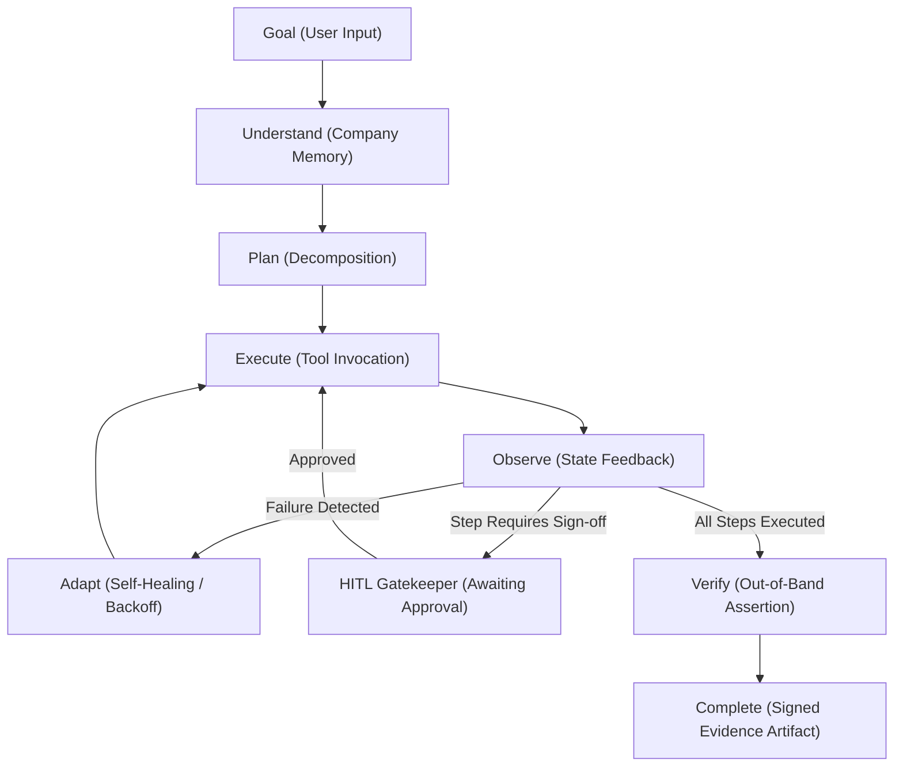

# CentrAlign AI — System Architecture Document

## 1. Architectural Philosophy

Traditional AI assistants act as passive advisors: they answer prompts and output unstructured prose, leaving the user to execute the actual work.

In contrast, **CentrAlign SecOps Operator** is designed as an **autonomous security operator**. It embodies three core architectural pillars:
1. **Outcome-Oriented Execution**: The agent is responsible for the transition of external system state (e.g. revoking database rows, disabling keys, hitting MDM APIs) rather than mere token generation.
2. **Context Grounding via Persistent Memory**: Unstated organizational context (e.g., security approval thresholds, employee alias resolution) is retrieved before planning.
3. **Independent Verification**: Action completion is never taken for granted based solely on an LLM's assertion; it is verified out-of-band against environmental ground truth.

---

## 2. The 8-Stage Cognitive Loop

The core execution engine implements the following deterministic state machine:

### Stage Details

| Phase | Description | Key Modules |
| :--- | :--- | :--- |
| **1. Goal** | Receives a natural language business objective from the operator or automated queue. | `ExecutionContext` |
| **2. Understand** | Queries persistent company memory to resolve aliases, retrieve security limits, and load relevant SOPs. | `CompanyMemory` |
| **3. Plan** | Decomposes the goal into sequential `ActionStep` nodes with explicit expected outcomes and tool bindings. | `BaseLLMProvider`, `AutonomousReasoningEngine` |
| **4. Execute** | Dispatches tool calls across SecOps databases, APIs, or portals. Checks the HITL gatekeeper prior to committing state. | `OperatorEngine`, `ToolRegistry` |
| **5. Observe** | Captures execution observations, outputs, and status codes. | `ToolResult`, `TraceEvent` |
| **6. Adapt** | Detects execution hiccups (e.g. HTTP 429 rate limit) and initiates self-healing replanning with backoff. | `adapt_plan()` |
| **7. Verify** | Executes deterministic SQL and state assertion queries out-of-band to confirm ground truth (0 active privileges). | `TaskVerifier`, `VerifySecurityStateTool` |
| **8. Complete** | Issues a signed audit bundle, hashes transaction state, records episodic learning, and returns evidence. | `ExecutionContext.final_summary` |

---

## 3. Subsystem Breakdown

### 3.1. Persistent Company Memory (`centralign/memory/`)
Company knowledge is maintained across two persistent stores:
- **Semantic & Policy Store (`store.py`)**: Stores corporate handbooks, authorization limits, and entity alias dictionaries. 
- **Episodic Learning Store (`store.py`)**: Records previous execution outcomes, errors, and resolutions so the operator continuously learns organization-specific idiosyncrasies.

### 3.2. Enterprise Tool Connector Mesh (`centralign/tools/`)
All tools implement the uniform `BaseTool` specification with schema validation:
- **`secops_systems.py`**: Interfaces directly with an SQLite enterprise database simulating Okta, AWS IAM, GitHub, and Jamf MDM. Calculates SHA-256 state checksums and updates status states.
- **`SimulatedBrowserTool`**: Automates enterprise web portals with page navigation, DOM inspection, and form submissions.
- **`APIGatewayTool`**: Connects to external microservices (e.g., AML Sanctions database, webhooks) with built-in transient failure injection to test self-healing.

### 3.3. Human-in-the-Loop Governance (`centralign/runtime/hitl.py`)
To prevent unchecked autonomous actions from causing enterprise-wide outages, the HITL Gatekeeper monitors all execution plans:
- **Policy Enforcement**: If a task targets a `CRITICAL` risk tier employee or an `AdministratorAccess` credential, the state machine suspends execution.
- **Asynchronous Resumption**: The engine yields a cryptographic lock state. The human CISO reviews the diff and calls `/api/approve` with a feedback payload, unblocking the engine.

### 3.4. Independent Verifier (`centralign/runtime/verifier.py`)
The most significant architectural departure from standard LLM agents. 
- LLMs suffer from "sycophancy" (they hallucinate success). 
- The `TaskVerifier` is an imperative Python state machine that bypasses the LLM completely, running strict database assertions (e.g. `SELECT COUNT(*) FROM cloud_iam_keys WHERE status = 'ACTIVE'`). 
- If invariants fail, the task is marked as FAILED regardless of the LLM's belief.

---

## 4. Execution Examples

**Standard Offboarding**:
- User: "Terminate all access for Ananya Roy"
- Action: Agent looks up Ananya, finds 1 SSO session, 1 AWS Key, 1 GitHub repo, 1 Mac. 
- Execution: Revokes everything.
- Verification: Assert 0 active keys, 0 active sessions. PASS.

**High-Risk Offboarding**:
- User: "Revoke Vikram Malhotra"
- Action: Agent identifies Vikram as CRITICAL DevOps Lead with AWS Root Access.
- Execution: Pauses execution -> AWAITING APPROVAL.
- HITL: CISO clicks approve.
- Execution resumes -> Revokes everything.
- Verification: Assert 0 active keys. PASS.
